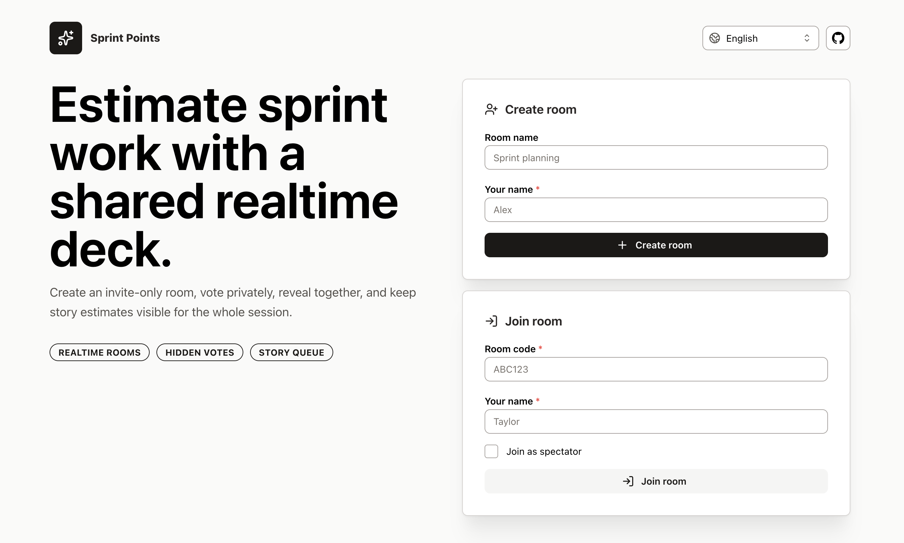
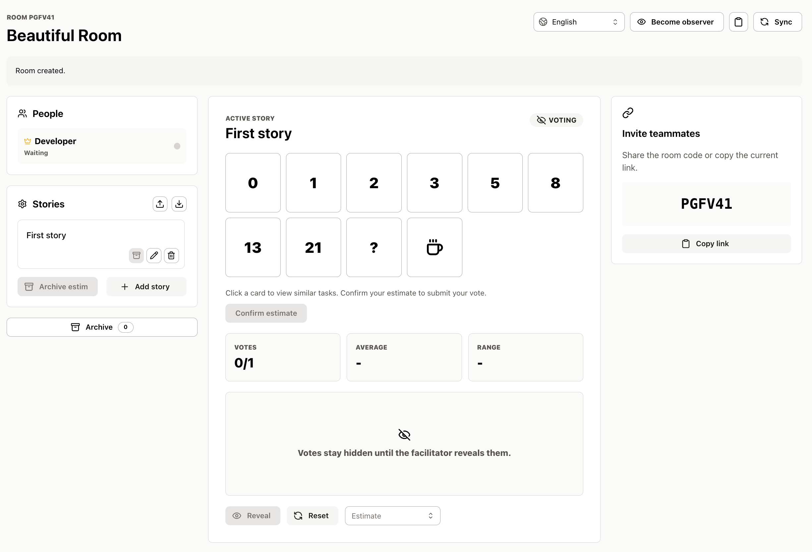
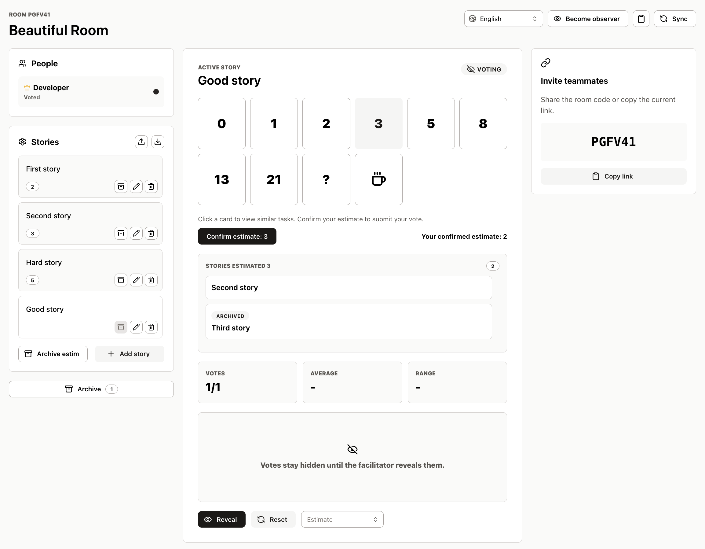
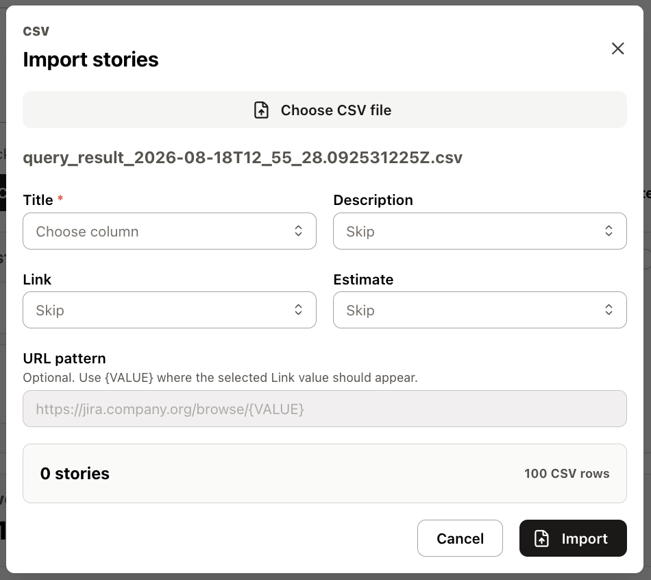

# Sprint Points

Sprint Points is a realtime planning poker app for agile teams. Create a room, invite teammates with a link, vote privately, reveal estimates together, and keep the story queue visible during refinement or sprint planning. Room changes are pushed to every participant over a WebSocket connection.

The app uses a React/Vite frontend and a Go backend backed by PostgreSQL in Docker Compose. The backend also supports SQLite for local development and tests.

## Screenshots









## Tech Stack

- Frontend: React, TypeScript, Vite
- UI: Mantine, lucide-react icons
- Backend: Go 1.24, GORM, SQLite/PostgreSQL

## Requirements

- Node.js 24+
- npm 11+
- Go 1.24+ and a C compiler (SQLite uses CGO)
- Docker and Docker Compose for VPS deployment

## Production Start On A VPS

Create DNS `A` records for both application hostnames pointing at the VPS:

- `sprintpoints.<your-domain>`
- `admin.<your-domain>`

Then clone the repository, create `.env`, and start the stack from the project root:

```bash
cp .env.example .env
```

Edit `.env` and set:

- `BASE_DOMAIN`
- `POSTGRES_PASSWORD`
- `PGADMIN_DEFAULT_EMAIL`
- `PGADMIN_DEFAULT_PASSWORD`

Start Docker Compose:

```bash
docker compose up -d --build
```

This starts:

- `caddy`: public HTTPS reverse proxy on ports `80` and `443`
- `db`: PostgreSQL 17 with a persistent Docker volume
- `backend`: Go API behind `https://sprintpoints.<your-domain>`
- `db-admin`: pgAdmin behind `https://admin.<your-domain>`

Health check:

```bash
curl https://sprintpoints.<your-domain>/api/health
```

The Go backend applies its schema migrations on startup, so `docker compose up -d --build` applies the current schema without a manual step. Go retains the existing Alembic revision identifiers in the database and remains compatible with databases created by the former Python backend. The historical Python implementation and migration scripts are available in Git history. Back up production data before deploying a backend migration.

## Database Admin UI

Docker Compose includes pgAdmin with a preconfigured login and a preconfigured connection to the app database.

Open:

```text
https://admin.<your-domain>
```

Sign in with the credentials from `.env`:

| Field | Value |
| --- | --- |
| Email | `PGADMIN_DEFAULT_EMAIL` |
| Password | `PGADMIN_DEFAULT_PASSWORD` |

The server named `Planning Poker` is imported automatically from `docker/pgadmin/servers.json`. Its database passfile is generated from the Postgres environment variables when the pgAdmin container starts, so users should not need to configure the database connection manually.

pgAdmin stores its own UI metadata in the `pgadmin_data` Docker volume. The app data stays in the `postgres_data` volume.
Caddy stores ACME certificates in the `caddy_data` Docker volume and issues certificates automatically when the DNS records resolve to the VPS.

## Local Development

Install frontend dependencies:

```bash
npm install
```

Run the Go backend locally (Go modules are resolved from `go.mod`):

```bash
export DATABASE_URL=sqlite:///./planningpoker.sqlite3
go run ./backend/cmd/server
```

In another terminal, start the frontend:

```bash
npm run dev
```

Open:

```text
http://localhost:5173/
```

Vite proxies `/api` to `http://127.0.0.1:8000` during development.

## Environment Variables

| Name | Required | Description |
| --- | --- | --- |
| `VITE_API_URL` | No | Frontend API base URL. Defaults to `/api`. |
| `VITE_BASE_PATH` | No | Override Vite base path, useful for custom domains. |
| `DATABASE_URL` | No | PostgreSQL (`postgres://` / `postgresql://` / legacy `postgresql+psycopg://`) or SQLite (`sqlite:///` / legacy `sqlite+pysqlite:///`) URL. Compose configures PostgreSQL from `POSTGRES_*`. Defaults to `sqlite:///./planningpoker.sqlite3`. |
| `LISTEN_ADDR` | No | HTTP listen address, default `:8000`. |
| `PLANNING_POKER_CORS_ORIGINS` | No | Comma-separated allowed browser origins. Defaults to `*`. |
| `BASE_DOMAIN` | Yes for Compose | Base domain used by Caddy. `sprintpoints` and `admin` subdomains are created from it. |
| `POSTGRES_DB` | Yes for Compose | PostgreSQL database name. |
| `POSTGRES_USER` | Yes for Compose | PostgreSQL username. |
| `POSTGRES_PASSWORD` | Yes for Compose | PostgreSQL password. |
| `PGADMIN_DEFAULT_EMAIL` | Yes for Compose | pgAdmin login email. |
| `PGADMIN_DEFAULT_PASSWORD` | Yes for Compose | pgAdmin login password. |

## Backend

The Go backend separates domain entities, HTTP handlers, persistence, request validation, and realtime notifications. See [backend/README.md](backend/README.md) for package responsibilities and request flow. SQLite and PostgreSQL share the same domain models and API contract.

Main tables:

- `rooms`: room metadata, card set, reveal state, active story, host token
- `participants`: room members, spectator flag, heartbeat timestamp, participant token
- `issues`: story queue, descriptions, links, order, final estimates, archive timestamps
- `votes`: one vote per participant per story

## Security Model

Room codes are invite links. Joining by code creates a participant token.

Room state and all room-scoped mutations require a token that belongs to that same room:

- A participant token can load that room, update that participant, heartbeat, vote as that participant, and subscribe to that room's WebSocket update stream (`/api/rooms/{room_id}/ws`, token passed as a query parameter).
- A host token can load that room as host and run facilitator actions such as reveal, reset, story management, estimates, and participant removal.
- A participant token from one room cannot read issues from another room.
- Tokens are not exposed to other participants in room state.

This is an anonymous invite-link model, not account-based workspace authentication.

## Development Commands

```bash
go run ./backend/cmd/server
```

Runs the Go API locally. The backend uses `DATABASE_URL` when set; otherwise it uses its local SQLite default.

```bash
go test -race ./...
go vet ./...
```

Runs Go tests (including PostgreSQL integration tests when `TEST_POSTGRES_URL` is set) and static checks. CI runs these with a PostgreSQL service.

HTTP contract regression tests use frozen responses captured from the former Python backend, so testing requires no Python installation. Go tests also cover authentication, token privacy, ownership transfer, voting, WebSocket notifications, and legacy database migrations. `/openapi.json`, `/docs`, and `/redoc` retain the original API documentation. WebSocket notifications use an in-process registry, so run one backend instance (as in the existing Compose deployment).

```bash
npm run dev
```

Runs the local frontend development server.

```bash
npm run build
```

Type-checks and builds the production frontend into `dist`.

```bash
npm run preview
```

Serves the production frontend build locally.

## Project Structure

```text
.
├── docker-compose.yml
├── backend/
│   ├── Dockerfile
│   ├── cmd/server/
│   ├── README.md           # Architecture and request flow
│   └── internal/
│       ├── domain/         # Rooms, participants, issues, votes
│       ├── httpapi/        # Routes and handlers grouped by feature
│       ├── storage/        # Database configuration, schema and migrations
│       ├── validation/     # Request schemas, coercion and JSON errors
│       └── realtime/       # Room WebSocket subscriptions and broadcasts
├── src/
│   ├── app/
│   ├── entities/
│   ├── features/
│   ├── pages/
│   ├── shared/
│   └── widgets/
├── .env.example
├── package.json
├── go.mod
└── vite.config.ts
```

## License

MIT
